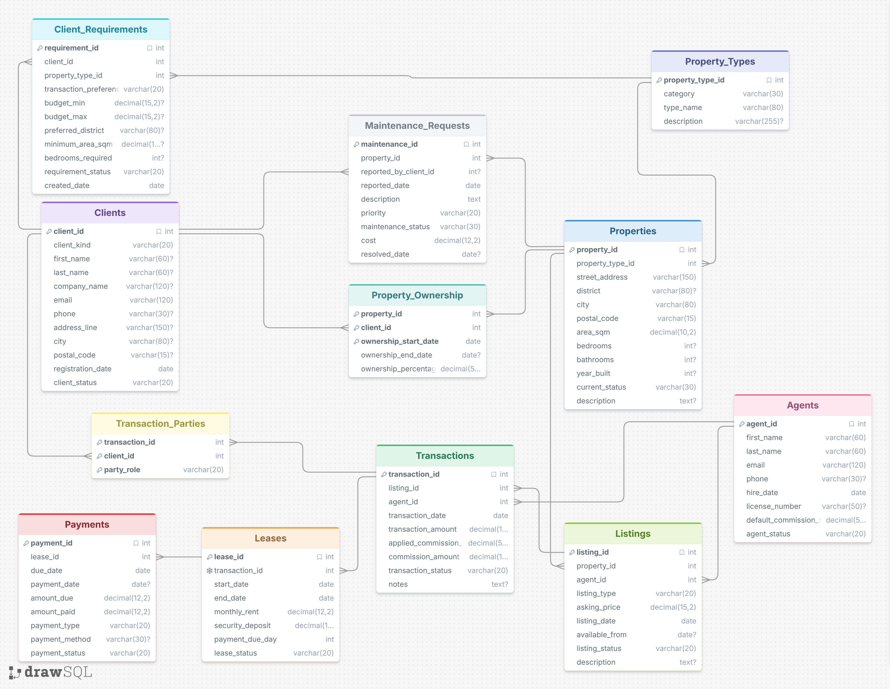
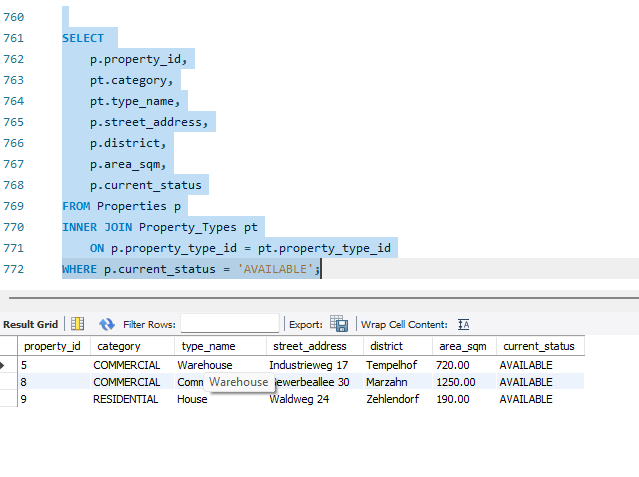
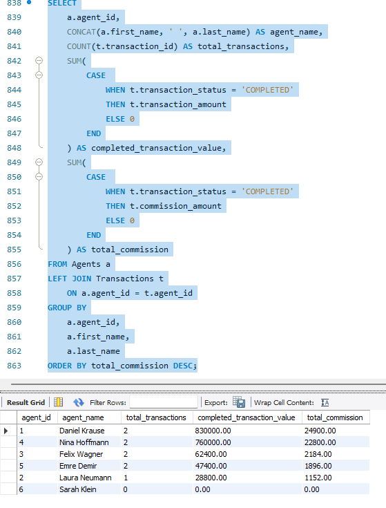
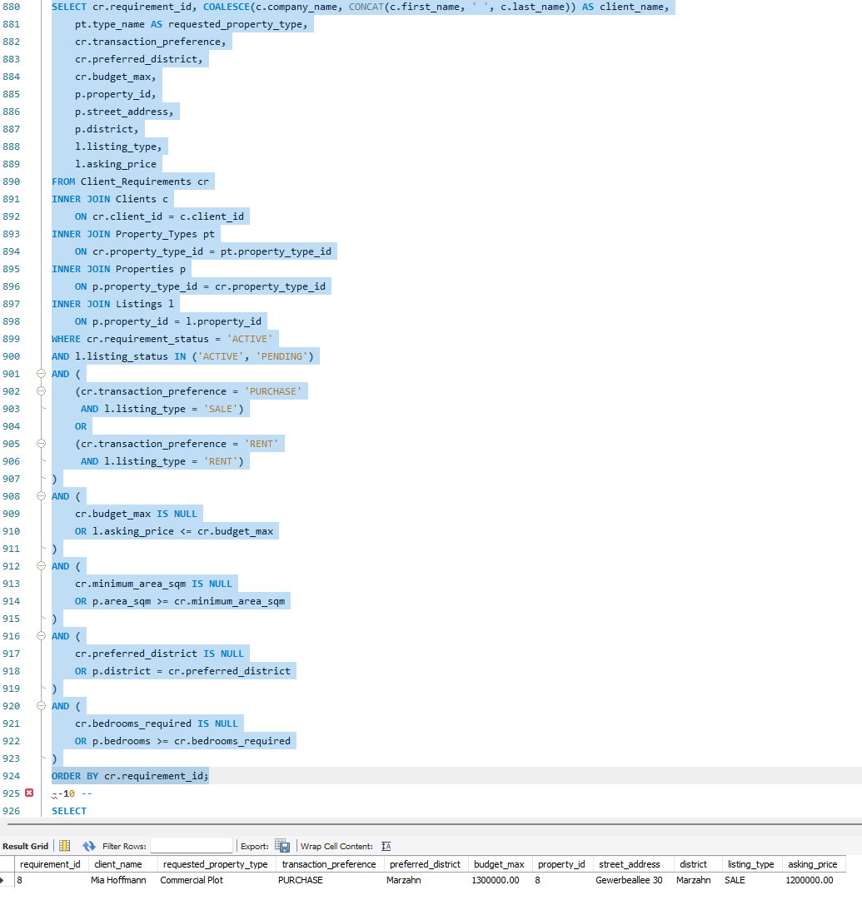
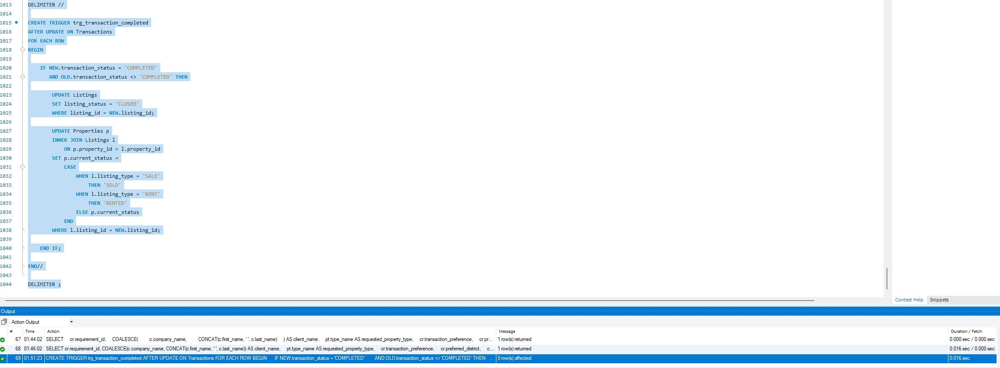
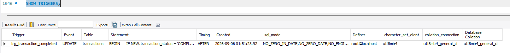
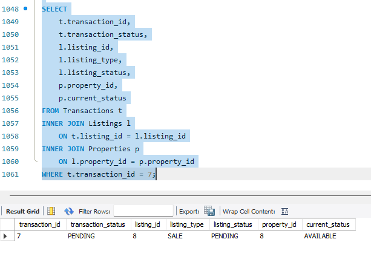
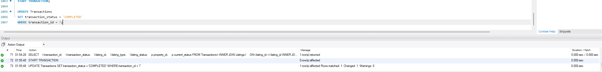
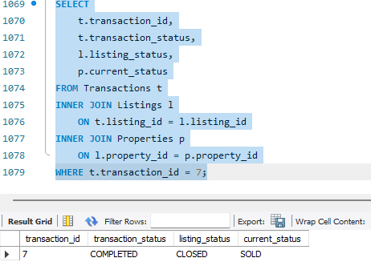
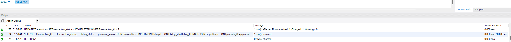

# BeRealty Real Estate Property Management Database

## Overview

**BeRealty** is a fictional Berlin-based real-estate agency created for an academic relational database project.

The project demonstrates the design and implementation of a complete **MySQL property-management database** capable of supporting residential and commercial property operations, including:

- property and property-type management
- client and agent records
- property ownership history
- client property requirements
- property listings
- sales and rental transactions
- transaction participants
- leases
- rent and deposit payments
- maintenance requests
- business reporting
- agent-performance analysis
- client-property matching
- automated property and listing status updates

The implementation was developed and tested using **MySQL Workbench**.

> **Important:** BeRealty is a fictional organisation created solely for academic purposes.  
> All clients, agents, properties, transactions, prices, addresses and other records in this repository are synthetic and do not represent a real company or actual Berlin real-estate market data.

---

## Project Objectives

The project was designed to demonstrate how a relational database can support both the operational and analytical requirements of a real-estate organisation.

The main objectives were to:

1. design a normalized relational database for property-management operations
2. represent complex relationships such as joint ownership and multi-party transactions
3. implement the design in MySQL using primary, foreign and composite keys
4. populate the database with realistic synthetic test data
5. demonstrate different SQL JOIN techniques
6. perform analytical queries and business reporting
7. implement monthly, quarterly and yearly transaction reports
8. automate transaction-completion behaviour using a MySQL trigger
9. preserve historical information such as ownership and applied commission rates
10. discuss how CAP theorem considerations could affect a future distributed version of the system

---

## Database Architecture

The system contains **12 relational tables**.

| Table | Purpose |
|---|---|
| `Agents` | Stores real-estate agent details and default commission rates |
| `Clients` | Stores individual and corporate clients |
| `Property_Types` | Defines residential and commercial property classifications |
| `Properties` | Stores physical property information and operational status |
| `Property_Ownership` | Records current and historical property ownership |
| `Client_Requirements` | Stores client purchase/rental requirements |
| `Listings` | Represents properties advertised for sale or rent |
| `Transactions` | Stores sales and rental transaction events |
| `Transaction_Parties` | Records the clients participating in each transaction |
| `Leases` | Stores rental agreements created from rental transactions |
| `Payments` | Records rent, deposit and related payment obligations |
| `Maintenance_Requests` | Records maintenance issues associated with properties |

The physical schema uses primary keys, foreign keys, composite keys and constraints to preserve relationships and data integrity.

---

## Entity-Relationship Model

The database is centred around the following operational flow:

```text
Property_Types
      |
      v
  Properties
      |
      v
   Listings
      |
      v
 Transactions
      |
      +--------------------+
      |                    |
      v                    v
Transaction_Parties     Leases
      |                    |
      v                    v
   Clients              Payments
```

Additional relationships support ownership, client requirements and maintenance:

```text
Clients
   |
   +---- Property_Ownership ---- Properties
   |
   +---- Client_Requirements ---- Property_Types

Properties
   |
   +---- Maintenance_Requests
```

### Full Entity-Relationship Diagram



---

## Design Decisions

### Properties and Listings

`Properties` and `Listings` are deliberately separated.

A property represents the **physical asset**, whereas a listing represents a particular market offer for that property.

This allows the database to preserve listing history if the same property is advertised multiple times.

### Property Ownership

Property ownership is represented through `Property_Ownership` rather than placing a single owner directly inside `Properties`.

This allows the system to support:

- joint ownership
- ownership percentages
- ownership start dates
- ownership end dates
- historical ownership changes

The table therefore resolves a many-to-many relationship between `Clients` and `Properties`.

### Transaction Parties

A transaction can involve different kinds of participants.

Instead of storing fields such as `buyer_id`, `seller_id`, `tenant_id` and `landlord_id` directly inside `Transactions`, the project uses `Transaction_Parties` with a `party_role` attribute.

Supported roles include:

- `BUYER`
- `SELLER`
- `TENANT`
- `LANDLORD`

This design allows a transaction to contain multiple participants without changing the database structure.

---

## Normalisation

The schema was designed using relational normalization principles through **Third Normal Form (3NF)**.

### First Normal Form

Attributes contain atomic values and repeating relationship groups are separated into their own rows.

For example, every participant in a transaction is represented as an individual row in `Transaction_Parties`.

### Second Normal Form

Attributes in relationship tables depend on the complete composite key.

For example:

```sql
PRIMARY KEY (
    property_id,
    client_id,
    ownership_start_date
)
```

in `Property_Ownership`, and:

```sql
PRIMARY KEY (
    transaction_id,
    client_id,
    party_role
)
```

in `Transaction_Parties`.

### Third Normal Form

Derived business information is not stored unnecessarily.

For example:

- agent performance is calculated from `Transactions`
- unpaid tenant balances are calculated from `Payments`
- transaction type is obtained from the associated `Listing`
- property-type information remains in `Property_Types`

This reduces avoidable redundancy and helps prevent update anomalies.

The design rationale follows established relational design and normalization principles (Codd, 1970; Bernstein, 1976; Storey, 1991).

---

## Historical Commission Design

Two commission-related values are deliberately retained:

- `Agents.default_commission_rate`
- `Transactions.applied_commission_rate`

These values represent different business facts.

The agent field represents the agent's **current standard commission rate**, while the transaction field records the **actual rate applied to a historical transaction**.

This ensures that changing an agent's default rate in the future does not alter historical transaction information.

---

## Synthetic Dataset

The database contains synthetic records designed to provide meaningful test scenarios.

| Entity | Records |
|---|---:|
| Agents | 6 |
| Clients | 12 |
| Property types | 7 |
| Properties | 10 |
| Ownership-history records | 14 |
| Client requirements | 8 |
| Listings | 10 |
| Transactions | 9 |
| Transaction parties | 19 |
| Leases | 4 |
| Payments | 11 |
| Maintenance requests | 6 |

The dataset intentionally contains different scenarios, including:

- residential and commercial properties
- sales and rentals
- active, pending, completed and cancelled transactions
- joint ownership
- historical ownership transfers
- individual and corporate clients
- agents with and without transaction history
- paid, partially paid and pending payments
- open and resolved maintenance requests

---

## SQL Query Portfolio

The project contains **14 operational and analytical queries**.

| Query | Purpose | Main SQL Concepts |
|---|---|---|
| Q1 | Available property inventory | `INNER JOIN`, `WHERE` |
| Q2 | Transactions handled by agents | `INNER JOIN`, `ORDER BY` |
| Q3 | Client transaction history | multi-table `INNER JOIN`, `COALESCE` |
| Q4 | Property and listing management | `LEFT JOIN` |
| Q5 | Agent activity | `RIGHT JOIN` |
| Q6 | Agent/property-type combinations | `CROSS JOIN` |
| Q7 | Agent performance | `COUNT`, `SUM`, `CASE`, `GROUP BY` |
| Q8 | Listings above average price by type | correlated subquery, `AVG` |
| Q9 | Client-property matching | multi-table joins, conditional filtering |
| Q10 | Outstanding tenant obligations | joins, calculated balance |
| Q11 | Monthly transaction report | `YEAR`, `MONTH`, `COUNT`, `SUM` |
| Q12 | Quarterly transaction report | `YEAR`, `QUARTER`, aggregation |
| Q13 | Yearly transaction report | `COUNT`, `SUM`, `AVG` |
| Q14 | Agents above average transaction value | `HAVING`, nested subquery |

---

## Q1 — Available Property Inventory

Retrieves properties that are currently available to clients.

The query joins `Properties` with `Property_Types` so internal type identifiers are replaced by meaningful categories and names.



---

## Q7 — Agent Performance

Compares agents using transaction count, completed transaction value and completed commission.

The query demonstrates conditional aggregation using `SUM`, `CASE`, `COUNT`, `GROUP BY` and a `LEFT JOIN`.



---

## Q9 — Client-Property Matching

Matches active client requirements with potentially suitable properties using:

- property type
- purchase/rental preference
- maximum budget
- minimum area
- preferred district
- required bedrooms



---

## Q10 — Outstanding Tenant Obligations

Identifies tenant payment records where:

```text
amount_paid < amount_due
```

and calculates the outstanding balance.

The query connects:

```text
Payments
→ Leases
→ Transactions
→ Transaction_Parties
→ Clients
```

to identify the tenant associated with each unpaid obligation.

---

## Business Reporting

### Monthly Report — Q11

Uses `YEAR()`, `MONTH()`, `COUNT()`, `SUM()` and `GROUP BY` to summarize completed transaction activity by month.

### Quarterly Report — Q12

Uses `YEAR()`, `QUARTER()`, `COUNT()`, `SUM()` and `GROUP BY` to summarize completed transaction activity by quarter.

### Yearly Report — Q13

Provides annual completed transaction count, transaction value, commission and average transaction value using `COUNT()`, `SUM()`, `AVG()` and `GROUP BY`.

### Above-Average Agent Analysis — Q14

Identifies agents whose total completed transaction value exceeds the average total across agents with completed transactions.

This query demonstrates `GROUP BY`, `HAVING`, `SUM`, `AVG` and a nested subquery.

---

## Trigger Automation

The project contains a MySQL trigger called:

```sql
trg_transaction_completed
```

The trigger executes:

```sql
AFTER UPDATE ON Transactions
```

and activates when a transaction changes from a non-completed status to `COMPLETED`.

It automatically:

1. changes the associated listing status to `CLOSED`
2. changes the property's status to `SOLD` for a sale
3. changes the property's status to `RENTED` for a rental

The core condition is:

```sql
IF NEW.transaction_status = 'COMPLETED'
   AND OLD.transaction_status <> 'COMPLETED' THEN
```

### Trigger Definition



### Trigger Installation



---

## Controlled Trigger Testing

The trigger test uses transaction `7`.

Before the test:

```text
Transaction = PENDING
Listing     = PENDING
Property    = AVAILABLE
```

The transaction is then changed to `COMPLETED`.

The trigger automatically changes the related records to:

```text
Transaction = COMPLETED
Listing     = CLOSED
Property    = SOLD
```

### Before Update



### Transaction Test



### Trigger Result



The test is deliberately executed inside:

```sql
START TRANSACTION;
```

and completed with:

```sql
ROLLBACK;
```

This restores the original synthetic dataset while leaving the trigger definition installed.

### Rollback Confirmation



---

## Running the Project

The complete implementation is contained in:

```text
berealty_db.sql
```

The SQL file is intentionally **standalone**.

It contains:

1. database creation
2. table creation
3. foreign-key relationships
4. synthetic sample data
5. validation queries
6. Q1-Q14 analytical queries
7. trigger definition
8. trigger verification
9. controlled trigger test
10. rollback

The script begins with:

```sql
DROP DATABASE IF EXISTS berealty_db;

CREATE DATABASE berealty_db;

USE berealty_db;
```

### Execution Using MySQL Workbench

1. Start **MySQL Workbench**
2. Connect to a MySQL server
3. Open `berealty_db.sql`
4. Execute the script from the beginning

The script creates the full project database and runs the included demonstrations.

No Docker environment or additional setup scripts are required.

---

## Repository Structure

```text
berealty-real-estate-database/
│
├── README.md
├── berealty_db.sql
│
└── screenshots/
    ├── F01_BeRealty_ERD.jpeg
    ├── F02_Agents.png
    ├── F03_Clients.png
    ├── F04_Property_Types.png
    ├── F05_Properties.png
    ├── F06_Property_Ownership.png
    ├── F07_Client_Requirements.png
    ├── F08_Listings.png
    ├── F09_Transactions.png
    ├── F10_Transaction_Parties.png
    ├── F11_Leases.png
    ├── F12_Payments.png
    ├── F13_Maintenance_Requests.png
    ├── F14_Available_Properties_Inner_Join.png
    ├── ...
    ├── F28_Trigger_Definition.png
    ├── F29_Show_Triggers.png
    ├── F30_Trigger_Test_Before.png
    ├── F31_Trigger_Test_Transaction.png
    ├── F32_Trigger_Result.png
    └── F33_Rollback_Confirmation.png
```

---

## Evidence Included

The `screenshots` directory contains implementation and execution evidence for:

- the complete entity-relationship diagram
- sample records for all 12 tables
- INNER JOIN execution
- LEFT JOIN execution
- RIGHT JOIN execution
- CROSS JOIN execution
- aggregation queries
- correlated and nested subqueries
- client-property matching
- outstanding payment analysis
- monthly reporting
- quarterly reporting
- yearly reporting
- trigger definition
- trigger installation
- trigger execution
- trigger-generated status changes
- rollback confirmation

---

## CAP Theorem Discussion

The implemented BeRealty system is a **single-node MySQL relational database**.

CAP behaviour is therefore not directly demonstrated by the implementation itself.

CAP becomes relevant if BeRealty is later deployed across replicated or geographically separated database nodes. During a network partition, a distributed system cannot simultaneously guarantee strong consistency and full availability for every operation (Gilbert & Lynch, 2002).

For critical operations such as property sales, property rentals, ownership transfers and transaction completion, the system should favour **consistency** because conflicting writes could create serious business integrity problems.

Less critical operations such as property browsing, search and reporting could potentially remain available using slightly stale replicated data.

This follows the more practical interpretation of CAP in which behaviour can differ by operation rather than treating a system as permanently belonging to a simple two-letter category (Brewer, 2012).

---

## Limitations

This repository represents an academic database prototype rather than a production property-management platform.

Important limitations include:

- synthetic sample data
- single-node MySQL implementation
- no authentication system
- no user-role security
- no complete audit-trail implementation
- no document-management system
- no geospatial or distance-based property search
- no full accounting ledger
- relatively small demonstration dataset
- client-property matching uses exact conditions rather than ranking or recommendation models

These limitations were intentionally kept outside the project scope so the implementation could focus on relational modelling, SQL querying, business analytics and database automation.

---

## Possible Future Extensions

Potential extensions include:

- authentication and role-based access control
- geospatial property search
- document and image storage
- audit logging
- dashboard reporting
- recommendation-based client-property matching
- indexing and query-performance optimisation
- stored procedures and views
- additional integrity constraints
- API integration
- web application integration
- distributed read replicas
- backup and recovery mechanisms

---

## Technologies and Concepts

### Database
- MySQL

### Development Environment
- MySQL Workbench

### SQL Concepts
- DDL
- DML
- Primary Keys
- Foreign Keys
- Composite Keys
- INNER JOIN
- LEFT JOIN
- RIGHT JOIN
- CROSS JOIN
- GROUP BY
- HAVING
- Aggregation
- Correlated Subqueries
- Nested Subqueries
- Conditional Aggregation
- Transactions
- Triggers

### Database Design
- Entity-Relationship Modelling
- Relational Modelling
- First Normal Form
- Second Normal Form
- Third Normal Form
- Many-to-Many Relationships
- Junction Tables
- Data Integrity
- Historical Data Preservation

---

## Academic Context

This project was developed as part of the **MSc Data Analytics** programme for the **Enterprise Data Warehouse and Database Management Systems** module.

The project combines:

```text
Database Design
        ↓
Relational Modelling
        ↓
MySQL Implementation
        ↓
SQL Analytics
        ↓
Business Reporting
        ↓
Trigger Automation
        ↓
Distributed-System Discussion
```

into one coherent fictional real-estate information system.

---

## References

The repository README is project documentation rather than the submitted academic report, so formal citation throughout is not necessary. The following references are included for the theoretical concepts discussed above:

- Bernstein, P.A. (1976). *Synthesizing third normal form relations from functional dependencies*. ACM Transactions on Database Systems, 1(4), 277–298. https://doi.org/10.1145/320493.320489
- Brewer, E.A. (2012). *CAP twelve years later: How the “rules” have changed*. Computer, 45(2), 23–29. https://doi.org/10.1109/MC.2012.37
- Codd, E.F. (1970). *A relational model of data for large shared data banks*. Communications of the ACM, 13(6), 377–387. https://doi.org/10.1145/362384.362685
- Gilbert, S. and Lynch, N. (2002). *Brewer's conjecture and the feasibility of consistent, available, partition-tolerant web services*. ACM SIGACT News, 33(2), 51–59. https://doi.org/10.1145/564585.564601
- Oracle. *MySQL 8.4 Reference Manual — CREATE TRIGGER Statement*. https://dev.mysql.com/doc/refman/8.4/en/create-trigger.html
- Storey, V.C. (1991). *Relational database design based on the entity-relationship model*. Data & Knowledge Engineering, 7(1), 47–83. https://doi.org/10.1016/0169-023X(91)90033-T

---

## Author

**Pratik Prakash Gawde**  
MSc Data Analytics  
Berlin, Germany  
2026
